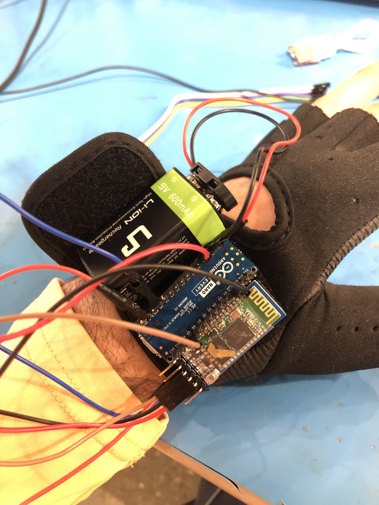

# Embodiment Research

During the Fall '23 semester, I worked as a part of the Wisconsin Institute of Discovery's (WID) Virtual Environment Group and was advised by [Dr. Kevin Ponto](https://wid.wisc.edu/people/kevin-ponto/) and [Ross Tredinnick](https://wid.wisc.edu/people/ross-tredinnick/). I feel extremely lucky to have worked on this project with them, and I am very grateful for all of the guidance they gave me throughout the semester.

Technologies Used:

- Unity 2021.3.24
- Oculus Integration Package
- Arduino Uno
- Bluetooth HC-05 shield
- A glove, velcro, and lots of wires!

## Technical Summary: 

I created a Unity application for deployment on a Meta Quest 2 headset. The application creates a Bluetooth connection with an Arduino Uno microcontroller using an HC-05 shield. The microcontroller, battery, and shield are all attached to the back of a glove. 

Inside the application, users can control the microcontroller by sending commands from an interface. These commands include turning an LED on/off and turning a haptic motor on/off. The application also tracks the user's hands and turns on the motor whenever an in-game ball collides with the tracked left-hand model.

<video src="https://drive.google.com/file/d/18a9KN7_vpPYGol0wG0OJBrW_0RneNZSl/view" width="320" height="240" controls></video>

## Research Summary 

The application described above was created with the purpose of exploring the ability of changing one's felt sense of body size using minimal haptic feedback as a potential means towards invoking non-dual awareness (NDA). Although it's a complicated concept with many different interpretations, I think of NDA as the lack of separation between inside and outside. It's a key insight in certain meditative practices.

## Hurdles

One hurdle at the start of the semester involved extensive and time-consuming research, navigating citation chains to gather necessary information. Next, I developed a system for sending messages from a Unity application on an Oculus headset to an Arduino microcontroller via Bluetooth HC-05, a process that proved more time-intensive than anticipated. Organizing code and adapting to new hardware constraints, such as finding a different system for motor control, were critical tasks during the course. Time management also posed a challenge, with unexpected setbacks like a malfunctioning motor controller and difficulties in getting a personal headset to work as a development machine. Synchronizing haptic feedback with the Unity application and overcoming technical issues, such as unrecognized Nano connectivity and challenging debugging related to avatar adjustments and ball-hand interaction, further added complexity to the semester's project. Despite these challenges, strategic problem-solving, time allocation, and adaptability were key approaches in successfully navigating the hurdles.

## Conclusion

Ultimately, the setup was unsuccessful in creating the desired effect of changing one's felt body-size or in being a tool to reveal NDA. However, I learned a ton about Unity, wearable tech, VR development, meditation, and research in general so it was a great semester!
